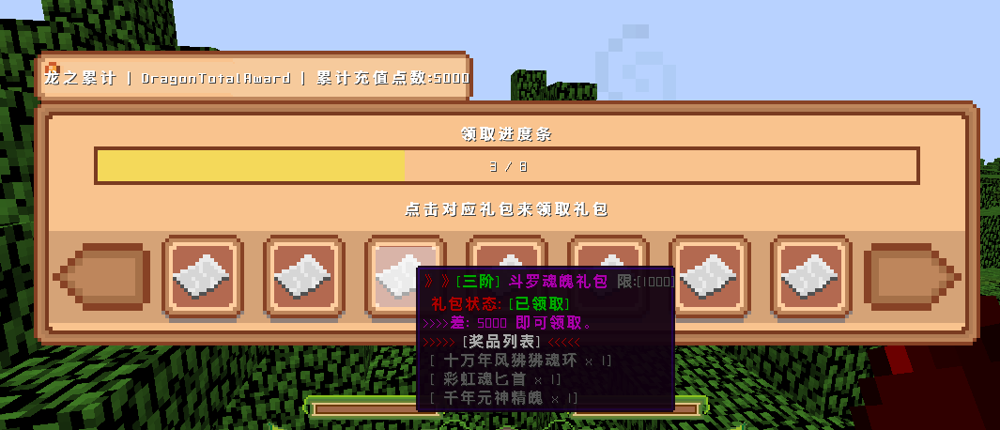

# 进服公告

|         |            |
| :-----: | :--------: |
| 适用服务端核心 |  1.12.2全核心 |
|   前置插件  | DragonCore |
|   可选前置  |      无     |

## 1.插件介绍

1.目前有两种轮播形式，可以配合自定义触发命令实现各种商城的跳转。

2.此类插件可以简单化一键配置进服一些信息。

3.可设置图床图片，无需更新客户端即可开箱使用。

## 2.插件展示


 (1).png>)

 (1) (1).png>)



 (1) (1) (1).png>)


## 3.插件指令

```
/DragonBanner | dbnr open  - 打开进服公告
/DragonBanner | dbnr reload - 重载插件
```


## 4.使用说明

1.拿到插件后丢进Plugin中，等待生成配置项，填写激活码。

2.在配置项中填写龙核的语法进行触发你需要的事件，例如执行命令，传送等。

3.配置你的图床和模式 delay:为-1 则不触发n秒后弹出 进服公告，自己用命令配合打开


## 5.配置项

```
Code: ""
# 进服显示时间 单位秒 -1为不开启 使用命令打开界面
delay: 4
BannerTypeSel: 1 #你所选的进服Banner类型 写1或者2
BannerType1:
  LoopTimer: "4000"
  BackGround: "https://tabclass.coding.net/p/minecraftproject/d/ResouceImg/git/raw/master/AutoBanner/%E5%85%AC%E5%91%8A.png"
  Banner1: "https://tabclass.coding.net/p/minecraftproject/d/ResouceImg/git/raw/master/AutoBanner/1.gif"
  Click1: "方法.播放声音()"
  Banner2: "https://tabclass.coding.net/p/minecraftproject/d/ResouceImg/git/raw/master/AutoBanner/2.gif"
  Click2: "方法.播放声音()"
  Banner3: "https://tabclass.coding.net/p/minecraftproject/d/ResouceImg/git/raw/master/AutoBanner/3.gif"
  Click3: "方法.播放声音()"
  Banner4: "https://tabclass.coding.net/p/minecraftproject/d/ResouceImg/git/raw/master/AutoBanner/4.gif"
  Click4: "方法.播放声音()"
  Banner5: "https://tabclass.coding.net/p/minecraftproject/d/ResouceImg/git/raw/master/AutoBanner/5.gif"
  Click5: "方法.播放声音()"
  buttonSel: "https://tabclass.coding.net/p/minecraftproject/d/ResouceImg/git/raw/master/AutoBanner/%E8%BD%AE%E6%92%AD%E9%80%89%E4%B8%AD.png"
  button: "https://tabclass.coding.net/p/minecraftproject/d/ResouceImg/git/raw/master/AutoBanner/%E8%BD%AE%E6%92%AD.png"
BannerType2:
  LoopTimer: "4500"
  BackGround: "https://tabclass.coding.net/p/minecraftproject/d/ResouceImg/git/raw/master/AutoBanner/%E5%85%AC%E5%91%8A.png"
  Banner1: "https://tabclass.coding.net/p/minecraftproject/d/ResouceImg/git/raw/master/AutoBanner/1.gif"
  Banner1Click: "方法.播放声音()"
  Banner2: "https://tabclass.coding.net/p/minecraftproject/d/ResouceImg/git/raw/master/AutoBanner/2.gif"
  Banner2Click: "方法.播放声音()"
  Banner3: "https://tabclass.coding.net/p/minecraftproject/d/ResouceImg/git/raw/master/AutoBanner/3.gif"
  Banner3Click: "方法.播放声音()"
  Banner4: "https://tabclass.coding.net/p/minecraftproject/d/ResouceImg/git/raw/master/AutoBanner/4.gif"
  Banner4Click: "方法.播放声音()"
  Banner5: "https://tabclass.coding.net/p/minecraftproject/d/ResouceImg/git/raw/master/AutoBanner/5.gif"
  Banner5Click: "方法.播放声音()"
  Left_button: "https://tabclass.coding.net/p/minecraftproject/d/ResouceImg/git/raw/master/AutoBanner/button.png"
  Left_button_: "https://tabclass.coding.net/p/minecraftproject/d/ResouceImg/git/raw/master/AutoBanner/button_.png"
  Boot1: "https://tabclass.coding.net/p/minecraftproject/d/ResouceImg/git/raw/master/AutoBanner/5.gif"
  Boot1Click: "方法.播放声音()"
  Boot2: "https://tabclass.coding.net/p/minecraftproject/d/ResouceImg/git/raw/master/AutoBanner/5.gif"
  Boot2Click: "方法.播放声音()"
  close: "https://tabclass.coding.net/p/minecraftproject/d/ResouceImg/git/raw/master/AutoBanner/CLOSE1.png"
  close_: "https://tabclass.coding.net/p/minecraftproject/d/ResouceImg/git/raw/master/AutoBanner/CLOSE0.png"
```

