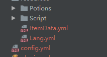

# 龙之兑换商城

## 1.插件介绍

1.基于龙核的仿失落 点券/金币/物品兑换/组合形式 的兑换MM物品插件

## 2.插件展示



## 3.插件命令

```
mkit reload [重载]
mkit kit 物品名 数量
mkit cdk 物品名 cdk [这个的物品名可以不用颜色符号]
mkit spawncdk 物品名 数量 [这个的物品名可以不用颜色符号]
mkit open 界面路径 [如: 商店/商店界面]
界面重载需使用core reload
```

## 4.PAPI变量

```
mookit_s_物品名_amount 服务器限购物品最大数量
mookit_p_物品名_amount 玩家限购物品购买数量
```

## 5.使用说明

#### 原理解释\[必读]

首先 这是配置 本部分讲解为ui配置部分 了解此部分可以更快的上手此插件

插件条件配置看附带的示例物品文件就行 这里只讲怎么去修改物品信息

如果你会龙核 看下Test先知道怎么配置 然后跳过对于部分123 直接看我简单叙述

```
要兑换的物品名标题名:
  # 一次性最大购买数量
  buyMax: 64
  # 加:判断全部 一个不符合就拒绝兑换
  sellType: "material:points:vault:permission:papi"
  # 兑换需求
  exchange:
    item: "§e物品名:1-§e物品名2:2"
    vault: "10"
    points: "10"
    permission: "xxx.xxx"
    # papi 文字判断 %xxx_xxx% is 文字
    # papi 数字判断 %xxx_xxx% = 数字 [判断支持符号 =  > >= < <=]
    # [特别注意 注意带空格分割]
    # papi: "%xxx_xxx% = a:%xxx_xxx% is vip"
  # 售卖截止日期 不配置就删除 到期就下架
  date: "2022-01-07"
  # mm物品中的物品名称 10个
  # 如果是剑之类的 建议写个1 哪怕多写几条 不然剑会堆在一起
  kits:
    # 默认mm物品
    - "MM名称:10"
    - "MM名称2:10"
    # 执行命令
    - "<cmd>[op/console]say:1"
  # 以下是龙核配置
  ui:
    # 物品所在商店配置
    shop: "礼包商店/礼包商店"
    # 物品配置
    item: "礼包商店/礼包商店-商品1"
    # 详情配置
    info: "礼包商店/礼包商店-商品1详情"
    buy: "礼包商店/礼包商店-购买界面"
  limit:
    # day:10 一天10个 限制只能写一个条件
    buy: "none/day:10/month:10/year:10/life:10"
```

一个物品在界面中有着三个部分

1\. 物品在兑换界面中的配置

2\. 物品详情显示

3\. 物品购买配置

这三个部分会在ui.shop配置中使用

当然这部分我已经处理 用户无需在意

下面是需要用户手动修改的部分

这部分涉及到了多个需要替换为新配置的情况 如商品1 替换为商品2

使用notepad++时 ctrl + F 有个全部替换选项 替换即可

**兑换界面**

```
商店设置:
  标题: §5§l礼包商店
```

**对于部分1**

```
商品1:
  # 决定了物品在界面中位于什么位置
  序号: 1
  # 这里需要与插件配置的队友 有颜色符号都要加 符号为§
  标题: "Test"
  贴图: "ui/gui/商店/礼包.png"
  详情: true
  价格图标tip: "§9点券"
  价格图标路径: "ui/gui/商店/点券.png"
  # 在这里写礼包里面的东西 当然不写也行
  贴图tip: |-
    §e§l元旦礼包
    §3显示物品详细信息
    §2可多行显示
```

物品配置中底图 物品图 名字 详情 按钮 价格文字 价格图片的Y轴需要配置

一般情况下的修改为

将商品1.序号 改成当前你的商品数字.序号

将商品2.序号 改成 商品数字+1.序号

另外，如果是最后一个商品 这是栗子

```
y: "变量.滚动位置变量+列表.y+方法.取Yaml值('商品2.序号')+20*(方法.取Yaml值('商品2.序号')-1)"
```

不用自动生成是因为需求不同可以自行拓展

```
商品1_底图:
  type: "图片"
  x: "列表.x+1"
  y: "变量.滚动位置变量+列表.y+方法.取Yaml值('商品1.序号')*方法.取Yaml值('商品2.序号')-1"
```

**对于部分2**

物品详情配置

```
商品1_槽位1:
  贴图: ui/gui/商店/礼包.png
  物品tip: |-
    §5元旦礼包
    §3显示物品详细信息
    §2可多行显示
    §a123435645
```

物品信息变量 用于购买等配置的索引

商品1详情\_背景

商品1详情\_\_标题

商品1详情\_关闭按钮

这三个的visible: 变量.商品数字详情界面

槽位物品的TIP

每个(1-8)商品数字详情\_槽位1下

x,y,visible,texture,tip的关键字

**对于部分3**

这个部分可以多个物品使用同一个

前提是他们在同一个兑换界面下

**简单叙述**

好了这里是简单叙述 直接看这里意味着你会龙核 我就简单说了

插件在购买界面.yml直接使用了指令 /mk kit 物品名变量 数量

其他全是龙核配置 包含

● 物品1 + 物品1详情

● 物品n + 物品n详情

● 购买界面

物品和对应详情详情我插件处理了 所以简单的修改下配置中的信息就行

配置的地方就是

比如 物品1.yml 和 物品详情.yml 里面的 商店1改成商店n 别让重复

对于限购我写了个变量 也是复制自带的配置改下关键字

每日/每月没写变量 按需在商店.限购.texts的合并文本那里加就行

物品信息需要手动修改 比如兑换条件什么的 因为papi真不如直接修改来的快和方便
