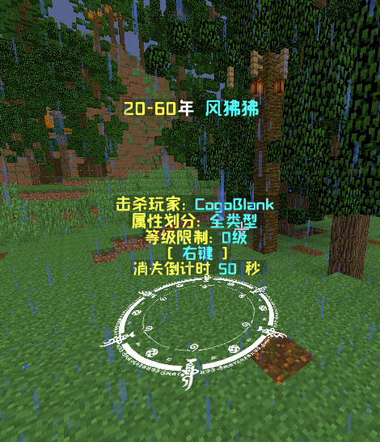
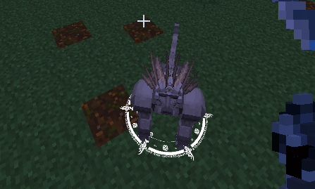
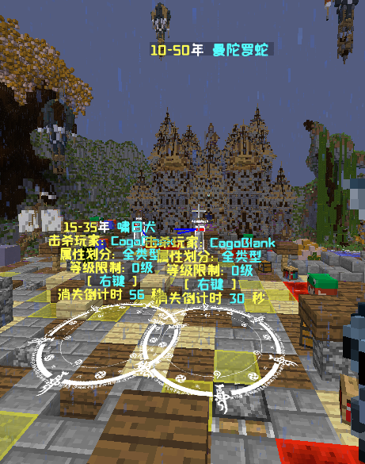

# 龙之魂环

|         |                                                             |
| :-----: | :---------------------------------------------------------: |
| 适用服务端核心 |                          1.12.2全核心                          |
|   前置插件  | ProtocolLib,TrHologram,PlaceholderAPI,DragonCore,MythicMobs |
|   可选前置  |                              无                              |

## 1.插件介绍

1.插件支持单武器,单槽位,多槽位,并且可以支持物品Name和Lore匹配,同时支持精准模糊.

2.插件支持单魂环单动画配置,掉落动画配置,自定义吸收界面,自定义吸收脚本,掉落支持Trhd高清显示.

3.渲染方式支持物品渲染,MM怪物渲染,魂兽渲染,人物渲染,

4.支持随机化掉落,随机化公式掉落,

5.支持本插件物品库与MM物品库,

## 2.插件展示

<figure><figcaption></figcaption></figure>

<figure><figcaption></figcaption></figure>

<figure><figcaption></figcaption></figure>

<figure><figcaption></figcaption></figure>

<figure><figcaption></figcaption></figure>

<figure><figcaption></figcaption></figure>

## 3.插件指令

```

&7=============== &b魂环系统 &7===============
&f/DragonSoulCircle | dsc change &7- &c魂环绽放 (必须选择配置命令,此命令才会触发)
&f/DragonSoulCircle | dsc reload &7- &c重载插件
&7=============== &b魂环系统 &7================
&7=============== &b魂环系统-物品库 &7================
&f/DragonSoulCircle|dsc list &7- &c查看物品库(鼠标点击获取 ,按住Shift获取一组)
&f/DragonSoulCircle|dsc AddItem [物品别名] &7- &c手持物品添加进物品库（删除请再ItemData中删除）
&f/DragonSoulCircle|dsc Get [物品别名] &7- &c获取物品库的物品
&f/DragonSoulCircle|dsc Get [物品别名] [玩家名] &7- &c获取物品库的物品给某一个人
&7=============== &b魂环系统-物品库 &7================
```

## 4.使用说明

<figure><figcaption></figcaption></figure>

1.群内下载最新版本魂环系统

2.安装前置

<figure><figcaption></figcaption></figure>

3.将SoulHoop放入客户端龙核心的文件夹中

<figure><figcaption></figcaption></figure>

4.插件丢进plugin中

<figure><figcaption></figcaption></figure>

5.进入config.yml填写激活码.

6.重启服务器.进入PluginDragonSoulCircle文件夹

<figure><figcaption></figcaption></figure>

EntityMobsConfig 是MM怪物渲染和掉落配置项

SoulCircleConfig 魂环配置

Scirpt 吸收脚本配置

ItemData 自带物品库配置

Lang 语言配置

SuckUpGui 吸收Gui配置

Config.yml 核心配置

首先教大家最简单使用本插件,用默认配置即可

进入游戏手持剑输入

/lore add 魂环1

然后再手持武器输绽放命令/dsc change 绽放就成功了

(如果要设置其他的单槽位和多槽位模式请看config.yml直接设置)

魂兽配置


```
# 渲染关键字[config.yml]中的EntityNameKey为基础
# 当名字包含EntityNameKey才视为魂兽 才会进行名字判断
# 例: MM怪物名字为: 风狒狒魂兽 渲染则启动
EntityNameKey: "深海魔鲸王"
# 渲染魂环标识 此处填 魂环配置中 Name 字段进行关联
RenderEntitySoulCircle:
  - "魂环1"
  - "魂环2"
  - "魂环3"
# 掉落配置 随机掉落魂环个数
DropRandom: 1
# 当DropRandom 掉落为1 时
# 将会随机选取下面一条执行
# 若选取到 "魂环1|0.5"
# 执行逻辑为 当此怪物死后将有百分之五十的几率
# 掉落 魂环1
DropSoulCircle:
  - "魂环1|0.5"
  - "魂环2|0.1"
  - "魂环3|0.4"
```

&#x20;首先MM怪物名字必须含有 魂兽两个字 这个在config.yml里设置 Key

第二点魂兽必须带上\[深海魔鲸王]

那么名字例: 超级深海魔鲸王魂兽

这样就可以给他套一个 输入mm m s 你的怪物就可以了

这样召唤出来自带了 魂环1 魂环2 魂环3

另外就是设置百分比了。

