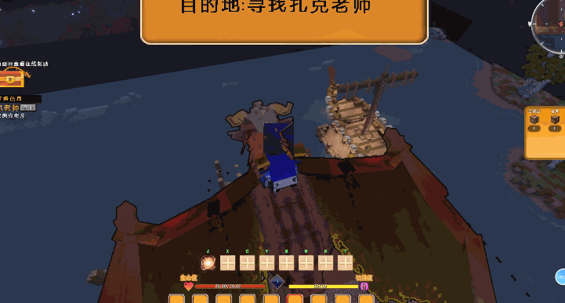

# 龙之旅行

| 适用服务端核心 |        1.12.2全核心       |
| :-----: | :--------------------: |
|   前置插件  | DragonCore，ProtocolLib |
|   可选前置  |     PlaceholderAPI     |

## 1.插件简介

1.支持在线设置路径多种路径配置。

2.支持海陆空三种旅行方式，增加你的乐趣同时，减少玩家跑路时间。

3.支持自定义图片显示目的地，可以配置动画和显示的位置，全部自定义。

4.自定义旅行器模型，支持多种模型自由搭配，搭配多种速度与权限。

5.支持起飞事件触发与落地事件触发，完全自定义你的命令。跨世界专用

6.支持落地无敌时间，防止其他玩家趁机攻击\~

7.支持跨服旅行，比如A服跨到B服。可以通过飞行到达。

## 2.插件展示



 (1) (1) (1) (1) (1) (1) (1) (1) (1).png>)

 (1) (1) (1) (1) (1) (1).png>)

 (1) (1) (1).png>)

 (2).png>)

## 3.插件命令

```
/dragontravel|dtr add [自定义路径名] - 添加一个路径的点位,没有则创建一个
/dragontravel|dtr remove [自定义路径名] - 移除上一个坐标。
/dragontravel|dtr list - 查看所有路径名。
/dragontravel|dtr run [自定义路径名] [模型名称] [玩家] - 让玩家骑上旅行器，按照线路旅行
/dragontravel|dtr run [自定义路径名] [模型名称] [玩家] [启用龙导航] - 运行一个旅行器并绑定导航(此命令等白龙)
```

## 4.使用说明

打开插件放进plugin中 配置龙核心实体

 (1) (1).png>)

上面放客户端下面放服务端

启动客户端+服务端

按照命令绘制路线，并运行路线

切记绘制路径的时候 下一个点 一定要面朝行驶的方向，不然会鬼畜。

命令如图所示

 (1) (1) (1) (1) (1) (1) (1).png>)

目录总览 路径存储目录与配置文件

 (1) (1) (1) (1) (1) (1).png>)

<details>

<summary>想要魔兽那种旅行？方便多个世界之间传送？你只需要在第一个旅行结束后，触发第二个旅行，即可连贯起来。</summary>


</details>

## 5.配置展示

```
#####################
#######激活码道具#####
#####################
Code: "" #验证
#####################
#######核心配置项#####
#####################
MaxSpeed: 0.4 #最大移动速度
NoShifit: true #禁止在旅行中下旅行坐骑
OfflineReturn: true  #玩家中途掉线直接传送到出发点 false则直接原地空中水中同样
EndInvulnerable: 3 # 玩家旅行结束后是否给个几秒无敌，防止被其他玩家直接干掉 设置为0则不设置
# 速度一定不要加太大了。否则会出现瞬移情况
PermissionSpeed:
  "dragontravel.vip1": 0.05
  "dragontravel.vip2": 0.08
  "dragontravel.vip3": 0.1

############# ########
#######旅行模型配置#####
######################
TravelEntity:
  Ride1:
    Name: 祥云 #此处填写镖车渲染名称
    #头顶部Texture显示的图片
    TextHeadtexture:
      TexturePath: "[text]目的地:%Point%"
      IsFollow: false #顶部是否跟随视角
      width: 0.1
      height: 0.2
      BindAnimation: "" #动画组 此处跟动画组联动 不写就是不加动画
      x: 0.05  # 文字显示 为了保证摆放在你想要的位置
      y: 3.0 #这个会加上实体自身身高
      z: -0.1
      rotatex: 0 # 偏转度数
      rotatey: 0
      rotatez: 0
    ImgHeadtexture:
      TexturePath: "TravelModel/title.png"
      IsFollow: false #顶部是否跟随视角
      width: 2.8
      height: 0.8
      BindAnimation: "" #动画组 此处跟动画组联动 不写就是不加动画
      x: 0  # 时间文字显示 为了保证摆放在你想要的位置
      y: 3.0 #这个会加上实体自身身高
      z: 0
      rotatex: 0 # 偏转度数
      rotatey: 0
      rotatez: 0
    Speed: 0.2 # 镖车基础速度
    StartDoCmd:
      - "tell %Player% 旅行开始，正在前往%Point%"
      - "tell %Player% 请坐好，抓紧副手"
    EndDoCmd:
      - "tell %Player% 兄弟到达了,%Point% 请开始你的征程吧"
  Ride2:
    Name: 蜘蛛 #此处填写镖车渲染名称
    #头顶部Texture镖车显示的图片
    TextHeadtexture:
      TexturePath: "[text]目的地:%Point%"
      IsFollow: false #顶部是否跟随视角
      width: 0.1
      height: 0.2
      BindAnimation: "" #动画组 此处跟动画组联动 不写就是不加动画
      x: 0.05  # 时间文字显示 为了保证摆放在你想要的位置
      y: 3.0 #这个会加上实体自身身高
      z: -0.1
      rotatex: 0 # 偏转度数
      rotatey: 0
      rotatez: 0
    ImgHeadtexture:
      TexturePath: "TravelModel/title.png"
      IsFollow: false #顶部是否跟随视角
      width: 2.8
      height: 0.8
      BindAnimation: "" #动画组 此处跟动画组联动 不写就是不加动画
      x: 0  # 时间文字显示 为了保证摆放在你想要的位置
      y: 3.0 #这个会加上实体自身身高
      z: 0
      rotatex: 0 # 偏转度数
      rotatey: 0
      rotatez: 0
    Speed: 0.25 # 镖车基础速度
    StartDoCmd:
      - "tell %Player% 旅行开始，正在前往%Point%"
      - "tell %Player% 请坐好，抓紧副手"
    EndDoCmd:
      - "tell %Player% 兄弟到达了,%Point% 请开始你的征程吧"

###################################
##########押镖车贴图动画组配置#########
###################################
animationList:
  action1:
    # 旋转动画设置
    RotateAnimation:
      delay: 0
      angle: 360.0
      duration: 6000
      cycleCount: 1
      fixed: true
      resetTime: 1
  action2:
    # 旋转动画设置
    RotateAnimation:
      delay: 0
      angle: 360.0
      duration: 6000
      cycleCount: 1
      fixed: true
      resetTime: 1
    # 上下动画设置
    TranslateAnimation:
      delay: 0
      distance: 1.1
      duration: 3000
      cycleCount: 1
      fixed: true
    # 缩放动画设置
    ScaleAnimation:
      delay: 0
      cycleCount: 1
      fixed: false
      fromScale: 3.0
      toScale: 1.0
      duration: 3000
```
